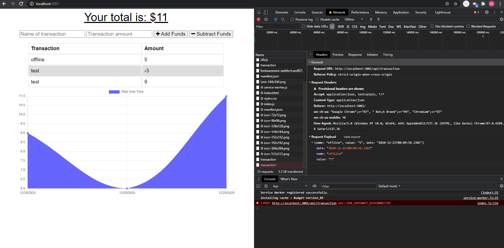
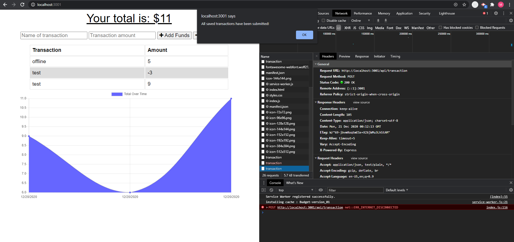
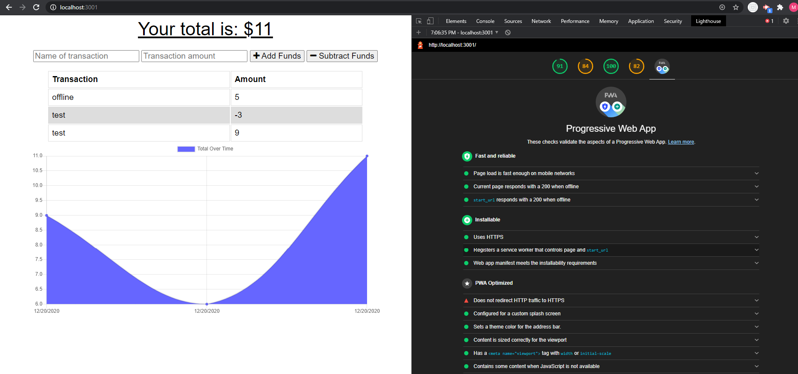

# budget-max

## Description 
Budget-Max is an Express-based, progressive web application (PWA) designed to allow users to track their budget, whether internet service is available or not. 

### User Story
* AS AN avid traveler
* I WANT to be able to track my withdrawals and deposits with or without a data/internet connection
* SO THAT my account balance is accurate when I am traveling 

## Table of Contents
* [Installation](#installation) 
* [Usage](#usage) 
* [Contributing](#contributing)
* [Questions](#questions)

## Link to Deployed Application
* [Budget-Max](https://budget-max.herokuapp.com/)

### Installation
Follow the deployed application link: https://budget-max.herokuapp.com/. From here, use the app online, and/or click the circled plus symbol in the url bar to install the PWA to your device for use offline.

### Usage
Type the name of a transaction, the amount, and click to either add or subtract the funds from your budget. A record of the transaction is kept, and reflected in the dynamic graph below the inputs. 

### Contributing
Budget-Max is an open source project built from starter code, cloned from the Vanderbilt University Coding Bootcamp. Anyone is encouraged to contribute by cloning or forking the code and working to improve its function and versatility.

### Questions
    
##### Interested in other projects from this developer? Visit the following GitHub page:
https://github.com/mplumer
    
##### Send any questions to the following email address:
maxplumer12@gmail.com

